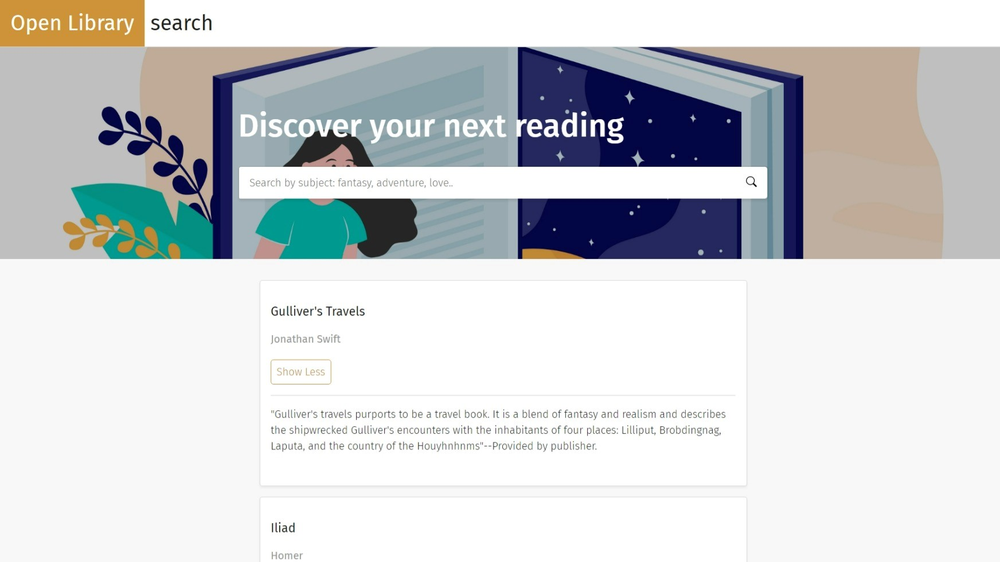

# Progetto JavaScript Advanced per Start2Impact

## Descrizione

Lo scopo del progetto è creare un'applicazione che attraverso delle chiamate API a [Open Library](https://openlibrary.org/developers/api) mostri una lista di libri, in base al genere specificato dall'utente nel campo di ricerca.

Inserendo un genere (adventure, fantasy, love, ecc) si avvia la chiamata per ottenere i dati e a schermo compare un feedback visivo ("Loading..") per indicare all'utente che la ricerca è in corso, dato che l'api può rispondere più o meno velocemente.

Se la ricerca è di successo, a schermo si presenteranno delle carte con i risultati, in alternativa un ulteriore feedback visivo ("No matches found") sarà visualizzato a schermo.

Dopo ogni ricerca il focus torna immediatamente nell'input per aiutare l'utente con le successive ricerche.

Ogni carta presenta titolo, autore e un bottone "Show More". Premuto il bottone, la scritta cambia in "Show Less" e in background viene chiamata un'altra api che, prendendo la chiave del libro specifico, porterà a schermo una descrizione del libro.

## Costruito con

- HTML
- CSS
- JS

## Screenshots

## Link

[Clicca qui per provare l'app](url)

## Istruzioni per clonare

Non sono presenti pacchetti esterni, l'app può essere utilizzata tranquillamente dal link o clonata in locale senza ulteriore configurazione.
